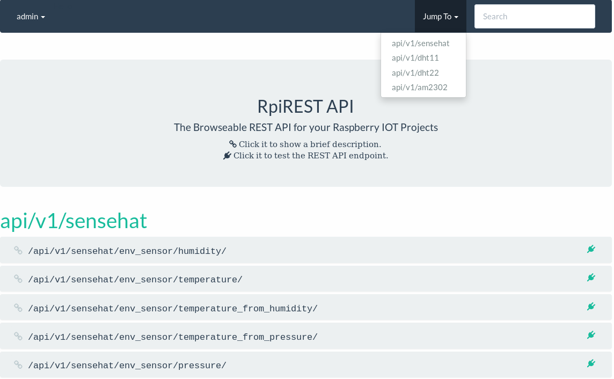
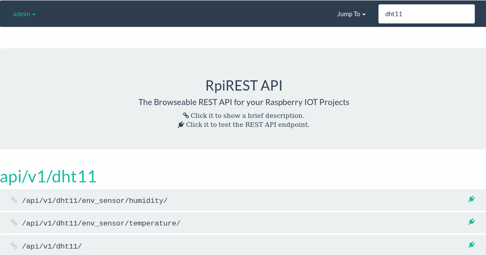

## Installation
* Install Raspbian in a RaspberryPi 2 or 3 with ssh access

* Desployment with Ansibble
  * git clone https://github.com/jregueirar/ansible-rpirest
  * ansible-galaxy install -r requiriments.yml
  * Edit inventory file with your Raspberrypi infraestructure
  * ansible-playbook pirest-sense-hat.yml -l rpis -i inventory

* Create superuser for login in the GUI
  * ssh rpi
  * cd /opt/pirest_sense_hat
  * python3 manage.py createsuperuser --username admin --email admin@localhost --noinput
  * python3 manage.py changepassword admin

* Login in the GUI with the superuser credentials

## Screenshots

